<picture>
  <source media="(prefers-color-scheme: dark)" srcset="./assets/header-dark.svg">
  
</picture>

<p align="center">
  <picture>
    <source media="(prefers-color-scheme: dark)" srcset="./assets/stats-dark.svg">
    
  </picture>
  <picture>
    <source media="(prefers-color-scheme: dark)" srcset="./assets/langs-dark.svg">
    
  </picture>
</p>

<picture>
  <source media="(prefers-color-scheme: dark)" srcset="./assets/graph-dark.svg">
  
</picture>

<picture>
  <source media="(prefers-color-scheme: dark)" srcset="https://raw.githubusercontent.com/sohammehta06/sohammehta06/output/snake-dark.svg">
  
</picture>

<!--START_SECTION:now-->
```
$ cat NOW.md
  building  · jitsu (yc s20)
  shipping  · open-source event pipeline — mit licensed, self-hostable
  reading   · sutton, anthropic engineering blog
  open to   · oss collabs in the agent + data space
```
<!--END_SECTION:now-->

<!--START_SECTION:activity-->
```
$ tail -n 7 ~/.activity.log
  3d ago    pr       awesome-mcp-servers        opened #12890
  3d ago    pr       awesome-data-engineering   opened #347
  4d ago    issue    mcpso                      opened #3740 [Submit] Jitsu — open-source CDP: manage data
```
<!--END_SECTION:activity-->

```
$ ls -1 ~/work
jitsu.com              open-source event pipeline. mit licensed, self-hostable.
weekday-trial          candidate score sheet + voice screening agent
lyzragentjobs          job board for agent-native roles
gooseworks-seo-ai      keyword discovery → drafts → quality gate
```

```
$ cat principles.txt
- ship daily, refactor weekly
- the best agent is the one in production
- read the source, not the docs
- if it can be a script, it should be
```

```
$ contact --list
mail   sohammehta.e@gmail.com
x      sohmehta
in     sohmehta
work   jitsu.com
```

<sub>
every graphic above is generated from the github api by
<a href="./scripts">scripts/</a> and committed by
<a href="./.github/workflows/rebuild.yml">a workflow</a> — no third-party badge
services, nothing to rate-limit, nothing to go stale.
last build <!--BUILD_TIME-->2026-08-29 01:38 UTC<!--/BUILD_TIME-->
</sub>
