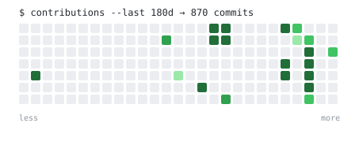

```
$ whoami
soham. building at gooseworks (yc w24). before, lyzr.
agents that ship work, not demos.
```

<!--START_SECTION:now-->
```
$ cat now.txt
building  · gooseworks (yc w24)
  shipping  · agents for gtm workflows
  reading   · sutton, anthropic engineering blog
  open to   · oss collabs in the agent space
```
<!--END_SECTION:now-->

<!--START_SECTION:activity-->
```
$ tail -f activity.log
  (no recent public activity)
```
<!--END_SECTION:activity-->

<picture>
  <source media="(prefers-color-scheme: dark)" srcset="./assets/graph-dark.svg">
  
</picture>

```
$ cat principles.txt
- ship daily, refactor weekly
- the best agent is the one in production
- read the source, not the docs
- if it can be a script, it should be
```

```
$ contact --list
mail   soham@gooseworks.ai
x      sohamehta_
site   sohamehta.com
```

<sub>this readme rebuilds itself every 6 hours · last build <!--BUILD_TIME-->2026-07-04 08:47 UTC<!--/BUILD_TIME--></sub>
